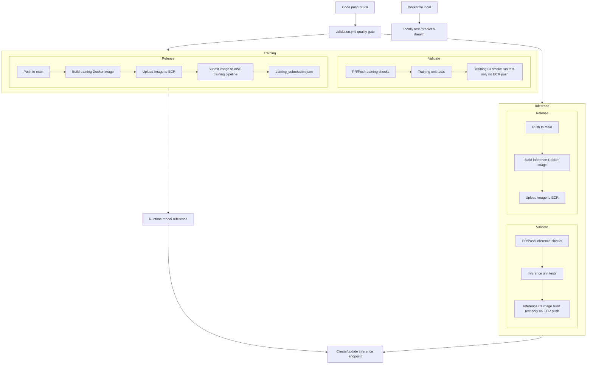

# mlpipeline

Minimal end-to-end ML pipeline take-home project with two clearly separated delivery paths:

- **Training path**: reproducible training, versioned artifacts, experiment logging, and a bridge toward continuous retraining.
- **Inference path**: lightweight Flask serving, model-agnostic deploy image, and runtime model selection.

The notebook walkthrough (`docs/01_notebook_local.md`) is retained as an exploratory/legacy path; the current maintained execution paths are `training/train.py` and `api/app.py` with CI workflows.

## Docs index

| Document | Purpose |
|---|---|
| `docs/QUICKSTART.md` | Fast local run commands |
| `docs/01_notebook_local.md` | Original notebook-only local walkthrough |
| `docs/02_training.md` | Training flow, artifacts, metrics, manifest |
| `docs/03_inference.md` | API behavior, model loading, Docker paths |
| `docs/04_monitoring.md` | Monitoring/observability design |
| `docs/05_tradeoffs.md` | Trade-offs and limitations |
| `.github/workflows/validation.yml` | Repo-wide quality gate |
| `.github/workflows/train.yml` | Training CI + submit workflow |
| `.github/workflows/inference.yml` | Inference CI + image release workflow |

## Architecture at a glance



## Training path

### What this path does

- Entry point: `training/train.py`.
- Trains a regression model from synthetic data or `--data-uri` input.
- Emits immutable versioned runs and updates a latest alias.
- Logs params/metrics/artifacts to MLflow (local file backend by default).

### Outputs

Per run under `runs/artifacts/runs/vNNN/`:

- `sample_model.joblib`
- `metrics.json`
- `model_version.txt`
- `manifest.json`

Active alias under `runs/artifacts/latest/` mirrors the same contract.

### CI and orchestration alignment

- **Validate (PR/push)**: `train.yml` runs training checks, training unit tests, and a small CI smoke run (**test-only, no ECR push**).
- **Release (push to `main`)**: build `Dockerfile.training`, upload image to ECR, and submit that image to the AWS training pipeline.
- Release handoff artifact: `training_submission.json`.

### Continuous retraining direction

The repository is set up for continuous retraining evolution via:

- external data input (`--data-uri`),
- versioned artifact + manifest contract,
- push-to-main release contract (build training image -> upload to ECR -> submit to AWS training pipeline),
- explicit SageMaker job/pipeline contract items in Productization section.

## Inference path

### What this path does

- Entry point: `api/app.py`.
- Endpoints:
  - `GET /health`
  - `POST /predict`
- Loads model artifacts via `api/model_loader.py` from either:
  - local `MODEL_DIR` (default `runs/artifacts/latest`), or
  - runtime `MODEL_ARTIFACT_URI` (including S3/local tarball flow).

### CI alignment

- **Validate (PR/push)**: `inference.yml` runs inference checks, inference unit tests, and an inference CI image build (**test-only, no ECR push**).
- **Release (push to `main`)**: build `Dockerfile.inference` and upload the image to ECR.
- `Dockerfile.local` is intentionally local-only, not part of inference release CI.

## Containerization model

Containerization is intentionally split according to purpose:

- **`Dockerfile.local`**: local verification image with baked local artifacts for quick `/predict` checks.
- **`Dockerfile.inference`**: model-agnostic deployment image; model reference is supplied at runtime.
- **`Dockerfile.training`**: training container contract for orchestrated training runs.

For future training in AWS, the intended flow is:

1. build `Dockerfile.training`,
2. push that image to ECR,
3. create/start a SageMaker Training Job or SageMaker Pipeline step that references the ECR image.

## Monitoring and observability

Quality signals come from CI, while operational/model observability is runtime-focused:

- **CI monitoring signals**
  - `validation.yml`: repo-wide lint + full tests.
  - `train.yml`: training path quality + submit metadata contract.
  - `inference.yml`: inference path quality + deploy image build contract.
- **Runtime monitoring signals**
  - structured JSON logs from `api/structured_logging.py` (`request_id`, `latency_ms`, `predict_ms`, status/error events, `model_version`),
  - log shipping via runtime log drivers/agents to CloudWatch,
  - design for API SLOs, model quality checks, and drift checks in `docs/04_monitoring.md`.

## Quick local commands

```bash
python -m venv .venv
source .venv/bin/activate
pip install -r requirements.txt

python training/train.py --output-dir runs/artifacts
python -m api.app

# Local verification image
docker build -f Dockerfile.local -t mlpipeline-api:local .
docker run --rm -p 8080:8080 mlpipeline-api:local
```

Prediction test:

```bash
curl -X POST http://127.0.0.1:8080/predict \
  -H "Content-Type: application/json" \
  -d '{"age": 42, "income_k": 88.0, "tenure_years": 6}'
```

## Deliverables status

- Reproducible training entrypoint: `training/train.py`
- Model artifact + params + metrics logging: MLflow (local file backend)
- Prediction API with validation + model version response: `api/app.py`
- Dockerized local verification path: `Dockerfile.local`
- Model-agnostic deploy image path: `Dockerfile.inference`
- CI split by responsibility: `validation.yml`, `train.yml`, `inference.yml`
- Monitoring design: `docs/04_monitoring.md`

## Productization considerations

Current choices in this repository:

- GitHub Actions is the primary orchestrator here for simplicity and transparency.
- Training orchestration can later move to dedicated managed orchestration while Actions remains validation/release trigger glue.
- Packaging training in `Dockerfile.training` keeps dependencies and runtime behavior consistent across local, CI, and managed compute, avoiding host-environment drift.
- Inference delivery intentionally favors model-agnostic images + runtime model references for operational simplicity.

## Plan for productization

1. Move training execution to managed jobs on AWS (SageMaker Training Jobs or SageMaker Pipeline training step).
2. Build and publish training image to ECR with explicit training job contract (I/O URIs, ResourceConfig, StoppingCondition, RoleArn, Region, optional VPC).
3. Attach managed experiment tracking/lineage (SageMaker Experiments or managed MLflow).
4. Publish model artifacts to a registry with staged promotion.
5. Gate promotions with quality checks + integration smoke tests.
6. Deploy inference service with environment-specific runtime model references and secrets.
7. Add production observability: latency/error SLOs, drift checks, post-deploy quality monitoring.
