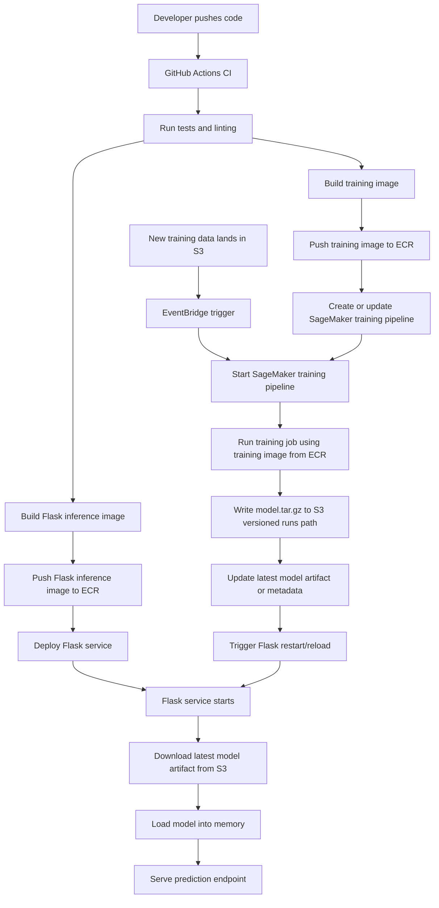

# mlpipeline

Minimal end-to-end ML pipeline take-home project covering:

- model training and versioned artifacts
- Flask inference API
- Docker packaging
- CI, monitoring, and trade-off documentation

## Quick links

- Quickstart only: `docs/QUICKSTART.md`
- Training details: `docs/02_training.md`
- Inference/API and Docker details: `docs/03_inference.md`
- Architecture diagram source: `docs/architecture.mmd`
- Monitoring design: `docs/plans/monitoring.md`
- Trade-offs: `docs/plans/tradeoffs.md`
- Validation workflow: `.github/workflows/validation.yml`
- Train workflow (skeleton): `.github/workflows/train.yml`
- Inference workflow (skeleton): `.github/workflows/inference.yml`

## Flow diagram


Source: `docs/architecture.mmd`

## Directory structure

```text
mlpipeline/
├── api/
│   ├── app.py
│   ├── model_loader.py
│   └── structured_logging.py
├── training/
│   ├── __init__.py
│   ├── train.py
│   ├── data.py
│   ├── modeling.py
│   ├── layout.py
│   ├── tracking.py
│   └── logging_utils.py
├── tests/
│   ├── conftest.py
│   ├── test_training.py
│   └── test_api.py
├── runs/
│   ├── artifacts/
│   │   ├── latest/
│   │   └── runs/
│   ├── logs/
│   └── mlruns/
├── .github/workflows/validation.yml
├── .github/workflows/train.yml
├── .github/workflows/inference.yml
├── Dockerfile.local
├── Dockerfile.inference
├── Dockerfile.training
├── requirements.txt
├── README.md
└── docs/
    ├── QUICKSTART.md
    ├── 01_notebook_local.md
    ├── 02_training.md
    ├── 03_inference.md
    ├── architecture.mmd
    └── plans/
        ├── agent-rules.md
        ├── monitoring.md
        ├── plan.md
        └── tradeoffs.md
```

## Current project workflow

### 1) Install dependencies

```bash
python -m venv .venv
source .venv/bin/activate
pip install -r requirements.txt
```

### Development

- `Linting`
  - `ruff check .`
- `Unit tests`
  - `pytest -q`

Linting and the full unit test suite run on every PR and push to `main` via `.github/workflows/validation.yml` (no training or inference Docker smokes).

**Product-specific CI (path-filtered):**

- **`.github/workflows/train.yml`** — On changes under `training/`, `tests/test_training.py`, shared `tests/conftest.py`, or `requirements.txt`: runs `pytest tests/test_training.py` and a small end-to-end `train.py` smoke. **workflow_dispatch** runs the manual submit flow (local train or AWS placeholders).
- **`.github/workflows/inference.yml`** — On changes under `api/`, `tests/test_api.py`, `Dockerfile.inference`, etc.: runs `pytest tests/test_api.py` and `docker build -f Dockerfile.inference`. **workflow_dispatch** builds a tagged image and uploads build metadata.

`Dockerfile.local` is for local `/predict` verification, `Dockerfile.inference` is the model-agnostic deployment image, and `Dockerfile.training` is the training image contract for orchestration. CI currently builds only **`Dockerfile.inference`** in the inference workflow.

### 2) Train model

```bash
python training/train.py --output-dir runs/artifacts
```

Training writes immutable run outputs and updates a latest alias:

- `runs/artifacts/runs/vNNN/`
  - `sample_model.joblib`
  - `metrics.json`
  - `model_version.txt`
- `runs/artifacts/latest/`
  - `sample_model.joblib`
  - `metrics.json`
  - `model_version.txt`
  - `manifest.json`

`metrics.json` includes model and quality metadata such as:

- `model_version`
- `rmse`
- `baseline_rmse`
- `passed_guardrail`
- `training_time_seconds`
- `git_commit` (when available)

Training params (`samples`, `random_seed`) are logged in MLflow run parameters.

The training step emits `runs/artifacts/latest/manifest.json` (and a run-scoped copy) used as the handoff contract for release orchestration.
The train workflow currently submits training (local fallback or AWS placeholder) and emits `training_submission.json` with execution/model location metadata for downstream monitoring/release workflows.

Training code is split into small modules under `training/`:

- `training/train.py` - CLI and orchestration entrypoint
- `training/data.py` - synthetic dataset generation
- `training/modeling.py` - validation, training, and metric computation
- `training/layout.py` - versioning and artifact directory/file layout
- `training/tracking.py` - MLflow + git commit tracking
- `training/logging_utils.py` - file logger setup

### 3) Run inference API locally

```bash
python -m api.app
```

Endpoints:

- `GET /health`
- `POST /predict`

Example:

```bash
curl -X POST http://127.0.0.1:8080/predict \
  -H "Content-Type: application/json" \
  -d '{"age": 42, "income_k": 88.0, "tenure_years": 6}'
```

Structured logs are JSON lines on stdout (`latency_ms`, `request_id`, etc.; see `api/structured_logging.py`). In AWS, a log driver or agent (for example ECS **awslogs** or **Fluent Bit** on EKS) forwards those lines to **CloudWatch Logs** — details in `docs/plans/monitoring.md` and `docs/03_inference.md`.

### 4) Run with Docker

```bash
docker build -f Dockerfile.local -t mlpipeline-api:local .
docker run --rm -p 8080:8080 mlpipeline-api:local
```

### 5) Inference image/release flow (skeleton)

- `Dockerfile.inference` builds a model-agnostic inference image (API code + dependencies only).
- `.github/workflows/inference.yml` builds and tags that image only (for example `inference-<git-short-sha>`); it does **not** bake in a model version or artifact URI.
- The workflow uploads `inference_build_metadata.json` with `image_uri`, `git_sha`, and region — for traceability of the **container**, not the model.
- The intended deployment pattern is:
  - deploy the generic image from your registry
  - set **`MODEL_ARTIFACT_URI`** at runtime (for example `s3://bucket/.../model.tar.gz` or a local path in dev)
  - optionally set **`MODEL_VERSION`** when there is no `model_version.txt` in the artifact bundle (for example raw tarball layout)
  - the Flask app resolves and loads the model at startup from `api/model_loader.py`.

## Deliverables status (take-home)

- Reproducible training entrypoint: `training/train.py`
- Model artifact + params + metrics logging: MLflow (local file backend)
- Prediction API: `api/app.py` with validation and model version response
- Dockerized API (local verification): `Dockerfile.local`
- Repo-wide lint + tests: `.github/workflows/validation.yml`; training/inference checks + images: `train.yml` / `inference.yml` (see Development → CI above)
- Monitoring design: `docs/plans/monitoring.md`
- Trade-offs and limitations: `docs/plans/tradeoffs.md`

## Productionization considerations

This project is intentionally local-first for take-home scope. In production, core concerns are:

- training compute should run remotely on managed CPU/GPU infrastructure, not developer laptops
- experiment tracking should use a managed backend (MLflow server or SageMaker Experiments)
- model artifacts should live in durable object storage and be promoted through environments
- deployments should bind API image version and model version for traceability
- API should include auth, rate limiting, and richer structured telemetry

## Considerations

- GitHub Actions is currently used as the primary orchestrator for simplicity and transparency in this take-home implementation. In a future production setup, GitHub Actions may be limited to validation/release triggers while training orchestration is handled by a dedicated workflow orchestrator.
- The exact orchestrator choice can evolve based on scaling, scheduling, observability, and environment-management requirements.
- For inference model delivery, this design favors operational simplicity over marginal startup gains: keep inference images model-agnostic and fetch versioned model artifacts from object storage at startup. In practice, large multi-layer image pulls can offset the expected startup benefit of baking model tarballs into images, while object storage is optimized for large-file downloads.

## Plan for productization

1. Move training execution to managed jobs on AWS (e.g., **SageMaker Training Jobs** or a **SageMaker Pipeline** that runs a training step). This is only sketched in CI today (`train.yml` AWS path is a placeholder). A real implementation must **define the training job/pipeline contract explicitly**, including at least:
   - **Container image** — build and push a training image to **ECR** (entrypoint, `train.py` or SageMaker’s expected interface, dependencies).
   - **Data and outputs** — **S3** (or supported) input channels for training data, and an S3 **output** path for `model.tar.gz` / artifacts.
   - **Compute** — **ResourceConfig**: **instance type** (chooses CPU vs GPU and memory footprint), **instance count** (distributed training), and **EBS volume size** for the training instance.
   - **Operational limits** — **StoppingCondition** (max runtime), optional **spot** / checkpointing strategy if using managed spot training.
   - **Identity and placement** — **IAM execution role** for SageMaker (S3, ECR, CloudWatch Logs); **Region**; optional **VPC / subnets / security groups** if data or endpoints must stay private.
   - **Orchestration shape** — whether GitHub Actions only **starts** `CreateTrainingJob` / `StartPipelineExecution` (async) and how completion is monitored (separate workflow, EventBridge, etc.).
2. Attach managed experiment tracking/lineage (SageMaker Experiments or managed MLflow).
3. Publish model artifacts to a registry with stage transitions (`staging` -> `production`).
4. Gate promotions with automated checks (quality thresholds + integration smoke tests).
5. Deploy inference service with environment-specific configuration and secrets management.
6. Add production observability: latency/error SLOs, data drift checks, and post-deploy quality monitoring.

The items under (1) are the standard knobs AWS expects when turning “run training in the cloud” into an actual SageMaker job or pipeline; they are listed here to show what remains **design work**, not an omission of awareness.

